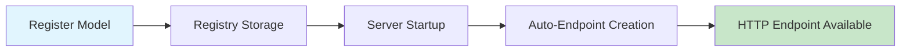

# Adding New Models to the Validation System

This guide explains how to add new model types to the modular validation system using the **registry-based architecture with automatic HTTP endpoint generation**.

## System Overview

The current system uses a **modular registry-based architecture** with **automatic HTTP endpoint generation**:

- **Models Package**: Defines data structures with validation tags
- **Validations Package**: Contains validation logic for each model type
- **Registry Package**: Manages model registration, validation orchestration, **and automatic HTTP endpoint creation**
- **Main Server**: Provides system endpoints and **automatically discovers and creates platform-specific endpoints**

## 🚀 **Revolutionary Feature: Automatic HTTP Endpoint Generation**

**NEW**: When you register a model with the registry, the system **automatically creates an HTTP endpoint** for it:

- **Register a model** → **Get a free HTTP endpoint**
- **No manual HTTP handler coding required**
- **Consistent validation response format**
- **Automatic endpoint discovery and registration**
- **Real-time endpoint availability**

### How Automatic Endpoint Generation Works:



1. **Model Registration**: `registry.RegisterCustomModel(modelInfo)` stores your model
2. **Automatic Discovery**: Server calls `registry.RegisterHTTPEndpoints(mux)` at startup
3. **Dynamic Creation**: System creates HTTP handlers for **ALL** registered models
4. **Instant Availability**: Endpoints at `/validate/{modeltype}` are immediately available

### What You Get Automatically:

```go
// When you register a model with type "shopify":
modelInfo := &registry.ModelInfo{
    Type: registry.ModelType("shopify"),
    // ... other fields ...
}
registry.RegisterCustomModel(modelInfo)

// You automatically get:
// ✅ POST /validate/shopify - HTTP endpoint
// ✅ JSON request/response handling
// ✅ Error handling and status codes
// ✅ Swagger documentation integration
// ✅ Model discovery via GET /models
```

## Quick Start

### Method 1: Using the Model Generator (Recommended)

The model generator creates all necessary files from templates:

```bash
# Navigate to the tools directory
cd src/tools

# Generate default configuration
go run model_generator.go -default -save-config=my_model.json

# Edit the configuration file
nano my_model.json

# Generate the model files
go run model_generator.go -config=my_model.json -output=../generated

# Or use interactive mode
go run model_generator.go -interactive -save-config=my_model.json
```

### Method 2: Manual Implementation (New Simplified Architecture)

With **automatic HTTP endpoint generation**, you only need **3 steps**:

1. **Create Model Structure**: Define the model in `src/models/`
2. **Implement Validator**: Create validation logic in `src/validations/`
3. **Register Model**: Add to the registry system → **HTTP endpoint automatically created!**

❌ **REMOVED**: No more manual HTTP handler coding!
✅ **AUTOMATIC**: HTTP endpoints are generated for you!

## Current File Structure

When you add a new model type (e.g., "Shopify"), you'll create:

```
src/
├── models/
│   └── shopify.go              # Model structures with validation tags
├── validations/
│   └── shopify.go              # Validation logic and business rules
├── registry/
│   ├── model_registry.go       # Central model registration (updated)
│   └── validation_manager.go   # Validation orchestration (updated)
├── main.go                     # HTTP handlers (updated)
└── test_data/
    ├── shopify_valid.json      # Example valid payload
    └── shopify_invalid.json    # Example invalid payload
```

## Generator Configuration

The model generator uses a JSON configuration file. Here's an example:

```json
{
  "service_name": "Shopify",
  "data_type": "webhook",
  "event_type": "order",
  "main_struct_name": "ShopifyWebhookPayload",
  "model_type_name": "shopify",
  "validator_var": "sv",
  "provider_name": "shopify_validator",
  "endpoint_path": "shopify",
  "var_name": "shopify",
  "valid_types": "order product customer",
  "field_count": 30,
  "rule_count": 25,
  "version": "1.0.0",
  "author": "Your Name",
  "description": "Shopify webhook validation with business rules",
  "tags": ["ecommerce", "webhook", "shopify"],
  "custom_fields": [
    {
      "name": "OrderID",
      "type": "string",
      "json_tag": "order_id",
      "validation_rules": "required,min=1,max=255"
    },
    {
      "name": "TotalPrice",
      "type": "string",
      "json_tag": "total_price",
      "validation_rules": "required,decimal"
    }
  ],
  "custom_validators": [
    {
      "tag": "shopify_order_id",
      "function_name": "validateShopifyOrderID",
      "description": "Shopify order ID format validation",
      "validation_logic": "return len(value) > 0 && strings.HasPrefix(value, \"gid://\")",
      "return_condition": "len(value) > 6 && strings.HasPrefix(value, \"gid://\")",
      "error_message": "must be a valid Shopify order ID (gid://...)",
      "example": "gid://shopify/Order/123456789"
    }
  ]
}
```

## Key Configuration Fields

### Basic Information
- `service_name`: The service/platform name (e.g., "Stripe", "Shopify")
- `data_type`: Type of data being validated (e.g., "webhook", "API response")
- `event_type`: Specific event type (e.g., "payment", "order", "notification")

### Generated Names
These are auto-generated but can be customized:
- `main_struct_name`: Main Go struct name (e.g., "StripeWebhookPayload")
- `model_type_name`: Registry model type (e.g., "stripe")
- `validator_var`: Validator variable name (e.g., "sv")

### Custom Fields
Define service-specific fields:
```json
{
  "name": "OrderID",           // Go field name
  "type": "string",            // Go type
  "json_tag": "order_id",      // JSON tag
  "validation_rules": "required,min=1"  // Validation rules
}
```

### Custom Validators
Define custom validation functions:
```json
{
  "tag": "shopify_order_id",   // Validator tag for use in struct tags
  "function_name": "validateShopifyOrderID",  // Go function name
  "description": "Order ID validation",       // Description
  "validation_logic": "return strings.HasPrefix(value, \"gid://\")",  // Implementation
  "error_message": "must be a valid order ID"  // Error message
}
```

## Manual Integration Steps (Current Architecture)

To add a new model to the current registry-based system:

### 1. Create Model File (`src/models/yourservice.go`)

```go
// Package models contains YourService webhook payload models with validation rules.
package models

import "time"

// YourServicePayload represents the webhook payload structure
type YourServicePayload struct {
    ID        string    `json:"id" validate:"required,min=1"`
    Type      string    `json:"type" validate:"required,oneof=event1 event2"`
    Timestamp time.Time `json:"timestamp" validate:"required"`

    // Add your service-specific fields with validation tags
    CustomField string `json:"custom_field" validate:"required,min=5,max=100"`
    Status      string `json:"status" validate:"required,oneof=active pending completed"`
    Amount      int64  `json:"amount,omitempty" validate:"omitempty,gte=0"`
}
```

### 2. Create Validation File (`src/validations/yourservice.go`)

```go
// Package validations contains YourService-specific validation logic
package validations

import (
    "fmt"
    "strings"

    "github.com/go-playground/validator/v10"
    "github-data-validator/models"
)

// YourServiceValidator handles validation for YourService payloads
type YourServiceValidator struct {
    validator *validator.Validate
}

// NewYourServiceValidator creates a new YourService validator instance
func NewYourServiceValidator() *YourServiceValidator {
    v := validator.New()

    // Register custom validators
    v.RegisterValidation("yourservice_custom", validateYourServiceCustomField)

    return &YourServiceValidator{
        validator: v,
    }
}

// ValidatePayload validates a YourService payload and returns structured results
func (ysv *YourServiceValidator) ValidatePayload(payload interface{}) models.ValidationResult {
    yourServicePayload, ok := payload.(models.YourServicePayload)
    if !ok {
        return models.ValidationResult{
            IsValid:   false,
            ModelType: "yourservice",
            Provider:  "go-playground",
            Errors: []models.ValidationError{{
                Field:   "payload",
                Message: "payload is not a YourService payload",
                Code:    "TYPE_MISMATCH",
                Value:   fmt.Sprintf("%T", payload),
            }},
        }
    }

    // Perform struct validation
    result := models.ValidationResult{
        IsValid:   true,
        ModelType: "yourservice",
        Provider:  "go-playground",
        Errors:    []models.ValidationError{},
        Warnings:  []models.ValidationWarning{},
    }

    if err := ysv.validator.Struct(yourServicePayload); err != nil {
        result.IsValid = false
        if validationErrors, ok := err.(validator.ValidationErrors); ok {
            for _, ve := range validationErrors {
                result.Errors = append(result.Errors, models.ValidationError{
                    Field:   ve.Field(),
                    Message: ve.Error(),
                    Code:    "VALIDATION_FAILED",
                    Value:   fmt.Sprintf("%v", ve.Value()),
                })
            }
        }
    }

    // Add business logic validation warnings
    if result.IsValid {
        result.Warnings = ysv.validateBusinessLogic(yourServicePayload)
    }

    return result
}

// validateYourServiceCustomField implements custom field validation
func validateYourServiceCustomField(fl validator.FieldLevel) bool {
    value := fl.Field().String()

    // Custom validation logic - example: must start with specific prefix
    if !strings.HasPrefix(value, "YS_") {
        return false
    }

    // Must be alphanumeric after prefix
    suffix := value[3:]
    for _, r := range suffix {
        if !((r >= 'A' && r <= 'Z') || (r >= 'a' && r <= 'z') || (r >= '0' && r <= '9')) {
            return false
        }
    }

    return true
}

// validateBusinessLogic performs business-specific validation checks
func (ysv *YourServiceValidator) validateBusinessLogic(payload models.YourServicePayload) []models.ValidationWarning {
    var warnings []models.ValidationWarning

    // Example business rule: High amounts should be flagged
    if payload.Amount > 10000 {
        warnings = append(warnings, models.ValidationWarning{
            Field:   "amount",
            Message: fmt.Sprintf("High amount detected: %d", payload.Amount),
            Code:    "HIGH_AMOUNT",
            Suggestion: "Review high-value transactions",
        })
    }

    // Example: Check for test data patterns
    if strings.Contains(strings.ToLower(payload.CustomField), "test") {
        warnings = append(warnings, models.ValidationWarning{
            Field:   "custom_field",
            Message: "Test data detected in production payload",
            Code:    "TEST_DATA_DETECTED",
            Suggestion: "Ensure test data is not sent to production",
        })
    }

    return warnings
}
```

### 3. Register Model in Registry (`src/registry/model_registry.go`)

Add your model type to the constants and update the registry:

```go
// Add to the ModelType constants
const (
    // ... existing model types ...
    ModelTypeYourService ModelType = "yourservice"
)

// Add initialization in init() function or create a separate registration function
func registerYourServiceModel() {
    validator := validations.NewYourServiceValidator()

    modelInfo := &ModelInfo{
        Type:        ModelTypeYourService,
        Name:        "YourService Webhook",
        Description: "YourService webhook payload validation with business rules",
        ModelStruct: reflect.TypeOf(models.YourServicePayload{}),
        Validator:   validator,
        Examples:    []interface{}{},
        Version:     "1.0.0",
        CreatedAt:   time.Now().Format(time.RFC3339),
        Author:      "System",
        Tags:        []string{"webhook", "yourservice"},
    }

    globalRegistry.RegisterModel(ModelTypeYourService, modelInfo)
}
```

## 🎉 **That's It! HTTP Endpoint Created Automatically!**

✅ **No Step 4 or 5 needed!** - The HTTP endpoint is **automatically created** when you register your model.

### What Happens Automatically:

When your model is registered, the system **automatically**:

1. **Creates HTTP Handler**: `POST /validate/yourservice` endpoint
2. **Handles JSON Parsing**: Parses incoming JSON to your model struct
3. **Runs Validation**: Uses your validator automatically
4. **Returns Results**: Structured JSON response with errors/warnings
5. **Sets Status Codes**: 200 for valid, 422 for invalid, 400 for bad JSON
6. **Updates Model List**: Your model appears in `GET /models` automatically
7. **Swagger Integration**: Your endpoint appears in API documentation

### Server Logs Show Auto-Registration:

```bash
🔄 Initializing automatic endpoint registration system...
🔄 Registering dynamic HTTP endpoints for all models...
✅ Registered endpoint: POST /validate/yourservice -> YourService Webhook
🎉 Successfully registered 8 dynamic validation endpoints

🎯 Platform-specific validation endpoints (AUTO-GENERATED):
  ✅ POST /validate/yourservice  - YourService Webhook
```

### Example Auto-Generated Endpoint Usage:

```bash
# Test your automatically created endpoint
curl -X POST http://localhost:8080/validate/yourservice \
  -H "Content-Type: application/json" \
  -d '{
    "id": "test_123",
    "type": "event1",
    "timestamp": "2023-01-01T00:00:00Z",
    "custom_field": "YS_valid_value",
    "status": "active",
    "amount": 1000
  }'

# Response (automatically formatted):
{
  "is_valid": true,
  "model_type": "yourservice",
  "provider": "go-playground",
  "errors": [],
  "warnings": [],
  "timestamp": "2023-01-01T00:00:00Z"
}
```

## Testing Your Model

### 1. Unit Tests

```go
func TestYourServiceValidation(t *testing.T) {
    validator := validations.NewYourServiceValidator()

    payload := models.YourServicePayload{
        ID:   "test_123",
        Type: "event1",
        Timestamp: time.Now(),
        CustomField: "valid_value",
    }

    result := validator.ValidatePayload(payload)
    assert.True(t, result.IsValid)
}
```

### 2. Integration Tests

```bash
# Test the HTTP endpoint
curl -X POST http://localhost:8080/validate/yourservice \
  -H "Content-Type: application/json" \
  -d '{
    "id": "test_123",
    "type": "event1",
    "timestamp": "2023-01-01T00:00:00Z",
    "custom_field": "valid_value"
  }'
```

### 3. Registry Tests

```go
func TestYourServiceRegistry(t *testing.T) {
    payload := models.YourServicePayload{ /* ... */ }

    result, err := registry.ValidateWithRegistry(
        registry.ModelType("yourservice"),
        payload,
    )

    assert.NoError(t, err)
    assert.True(t, result.IsValid)
}
```

## Common Validation Rules

### Struct Tags
```go
// Basic validations
Field string `json:"field" validate:"required,min=1,max=100"`

// Format validations
Email string `json:"email" validate:"required,email"`
URL   string `json:"url" validate:"required,url"`

// Numeric validations
Amount int64 `json:"amount" validate:"required,gte=0,lte=1000000"`

// Choice validations
Status string `json:"status" validate:"required,oneof=active inactive pending"`

// Custom validations
CustomID string `json:"custom_id" validate:"required,your_custom_validator"`
```

### Custom Validator Implementation
```go
func validateYourCustomField(fl validator.FieldLevel) bool {
    value := fl.Field().String()

    // Example: Check if value starts with a prefix
    if !strings.HasPrefix(value, "prefix_") {
        return false
    }

    // Example: Check length
    if len(value) < 10 || len(value) > 50 {
        return false
    }

    // Example: Regex validation
    matched, _ := regexp.MatchString(`^prefix_[a-zA-Z0-9]+$`, value)
    return matched
}
```

## Business Logic Examples

```go
func ValidateYourServiceBusinessLogic(payload models.YourServicePayload) []models.ValidationWarning {
    var warnings []models.ValidationWarning

    // Example: Check for test data in production
    if strings.Contains(payload.CustomField, "test") {
        warnings = append(warnings, models.ValidationWarning{
            Field:   "CustomField",
            Message: "Test data detected",
            Code:    "TEST_DATA",
            Suggestion: "Ensure test data is not processed in production",
            Category: "environment",
        })
    }

    // Example: Check for suspicious patterns
    if payload.Amount > 1000000 {
        warnings = append(warnings, models.ValidationWarning{
            Field:   "Amount",
            Message: "Very large amount detected",
            Code:    "LARGE_AMOUNT",
            Suggestion: "Review large amounts for accuracy",
            Category: "business-logic",
        })
    }

    return warnings
}
```

## Server Configuration

Add your model to the server configuration:

```json
{
  "custom_models": [
    {
      "type": "yourservice",
      "name": "Your Service Webhook",
      "description": "Your service webhook validation",
      "version": "1.0.0",
      "author": "Your Name",
      "tags": ["webhook", "yourservice"]
    }
  ]
}
```

## 🏗️ **System Architecture: How Automatic Endpoints Work**

### Behind the Scenes: Automatic HTTP Endpoint Generation

The system uses **reflection** and **dynamic handler creation** to automatically generate HTTP endpoints:

```go
// In registry/model_registry.go
func (mr *ModelRegistry) RegisterHTTPEndpoints(mux *http.ServeMux) {
    for modelType, modelInfo := range mr.models {
        endpointPath := "/validate/" + string(modelType)

        // Create dynamic handler using closure and reflection
        mux.HandleFunc("POST "+endpointPath, mr.createDynamicHandler(modelType, modelInfo))
        log.Printf("✅ Registered endpoint: POST %s -> %s", endpointPath, modelInfo.Name)
    }
}

func (mr *ModelRegistry) createDynamicHandler(modelType ModelType, modelInfo *ModelInfo) http.HandlerFunc {
    return func(w http.ResponseWriter, r *http.Request) {
        // 1. Create new instance of the model struct using reflection
        modelInstance := reflect.New(modelInfo.ModelStruct).Interface()

        // 2. Parse JSON payload into the model struct
        if err := json.NewDecoder(r.Body).Decode(modelInstance); err != nil {
            sendJSONError(w, "Invalid JSON payload", http.StatusBadRequest)
            return
        }

        // 3. Dereference pointer and validate using the registry
        modelValue := reflect.ValueOf(modelInstance).Elem().Interface()
        result, err := mr.ValidatePayload(modelType, modelValue)

        // 4. Return structured response
        if !result.IsValid {
            w.WriteHeader(http.StatusUnprocessableEntity)
        }
        json.NewEncoder(w).Encode(result)
    }
}
```

### Key Architecture Benefits:

1. **Type Safety**: Uses Go's reflection to create correct model instances
2. **Consistency**: All endpoints behave identically with standardized responses
3. **Maintainability**: Single point of endpoint creation logic
4. **Scalability**: Adding models only requires registration, no HTTP code
5. **Real-time**: Models registered at runtime get endpoints immediately

### Registry-Based Model Management:

```go
// Model registration stores everything needed for HTTP endpoints
type ModelInfo struct {
    Type        ModelType                    // "shopify", "stripe", etc.
    Name        string                       // Human-readable name
    Description string                       // Model description
    ModelStruct reflect.Type                 // Go struct type for reflection
    Validator   PayloadValidator            // Validation implementation
    Examples    []interface{}               // Example payloads
    Version     string                      // Model version
    Tags        []string                    // Categorization tags
}

// PayloadValidator interface ensures consistent validation
type PayloadValidator interface {
    ValidatePayload(payload interface{}) models.ValidationResult
}
```

## 🎯 **Available Endpoints**

Once registered, your model will be available through:

### **Automatic Platform-Specific Endpoints**:
- ✅ `POST /validate/yourservice` - **Auto-generated** dedicated endpoint
- ✅ `POST /validate/github` - GitHub webhook validation (auto-generated)
- ✅ `POST /validate/gitlab` - GitLab webhook validation (auto-generated)
- ✅ `POST /validate/bitbucket` - Bitbucket webhook validation (auto-generated)
- ✅ `POST /validate/slack` - Slack webhook validation (auto-generated)
- ✅ `POST /validate/api` - API request/response validation (auto-generated)
- ✅ `POST /validate/database` - Database operations validation (auto-generated)
- ✅ `POST /validate/generic` - Generic payload validation (auto-generated)

### **System Endpoints**:
- 📊 `GET /health` - Server health check
- 📝 `GET /models` - **Dynamic** list of all registered models
- 🔄 `POST /validate` - Generic endpoint with explicit model type in payload
- 📚 `GET /swagger/` - Interactive Swagger UI documentation
- 🔍 `GET /swagger/doc.json` - OpenAPI 3.0 specification (JSON)
- 📄 `GET /swagger/models` - **Dynamic** model schemas and metadata

### **Endpoint Response Format**:

All auto-generated endpoints return consistent JSON responses:

```json
{
  "is_valid": true,
  "model_type": "yourservice",
  "provider": "go-playground",
  "validation_profile": "strict",
  "timestamp": "2023-01-01T00:00:00Z",
  "processing_duration": "15ms",
  "request_id": "val_1672531200000",
  "errors": [],
  "warnings": [
    {
      "field": "amount",
      "message": "High amount detected: 15000",
      "code": "HIGH_AMOUNT",
      "suggestion": "Review high-value transactions",
      "category": "business-logic"
    }
  ],
  "context": {
    "validation_manager": true,
    "model_type": "yourservice",
    "total_processing_duration": "18ms"
  }
}
```

## Troubleshooting

### Model Not Found
- Ensure registration function is called at startup
- Check model type name matches registry entry
- Verify no registration errors in logs

### Validation Failures
- Check struct tag syntax
- Verify custom validators are registered
- Review validation logic implementation

### Performance Issues
- Monitor field count and rule count
- Optimize business logic validations
- Consider caching for identical payloads

## Examples

See the `examples/` directory for:
- `stripe_model_config.json` - Complete Stripe model configuration
- Generated Stripe model files
- Server configuration examples
- Test payload examples

## Contributing

When contributing new models:

1. Use the model generator for consistency
2. Include comprehensive test cases
3. Document all custom validators
4. Provide example payloads
5. Update integration guides
6. Follow naming conventions